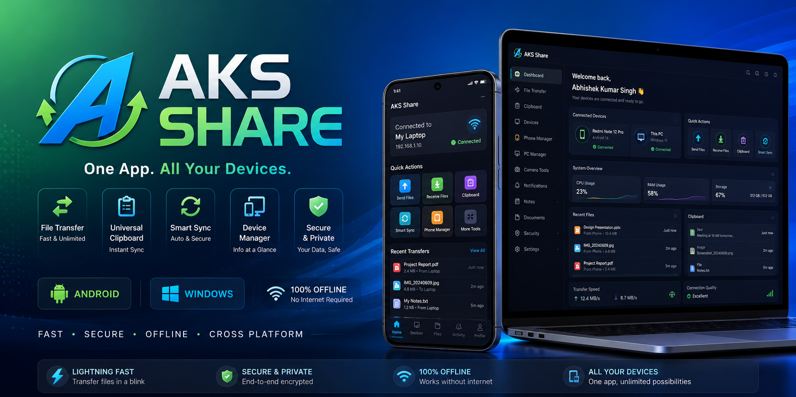

<p align="center">
  
</p>

<h1 align="center">🚀 AKS Share</h1>

<h3 align="center">
One App. All Your Devices.
</h3>

<p align="center">
Fast • Secure • Offline • Cross Platform
</p>

<p align="center">


</p>

---

# 📖 About AKS Share

AKS Share is a modern cross-platform **Android & Windows Device Companion** built with Flutter.

It combines powerful productivity and device management tools into a single application.

Whether you want to transfer files, sync your clipboard, use your phone as a webcam, manage storage, or work offline, **AKS Share** provides everything in one place.

---

# ✨ Key Features

## 📁 File Transfer

- Android ↔ Windows
- Android ↔ Android
- Windows ↔ Windows
- Unlimited File Size
- Entire Folder Transfer
- Resume Transfer
- Drag & Drop
- QR Connect

---

## 📋 Universal Clipboard

- Copy Text
- Copy Images
- Copy Files
- Clipboard History
- Instant Sync

---

## 🔄 Smart Sync

- Photos
- Videos
- Documents
- Background Sync
- Auto Sync

---

## 📱 Phone Manager

- Battery
- RAM
- Storage
- Installed Apps
- File Manager
- Device Information

---

## 💻 PC Manager

- CPU Usage
- RAM Usage
- Disk Usage
- File Explorer
- Quick Access

---

## 📸 Camera Tools

- Phone as Webcam
- Scan Documents
- OCR (Image → Text)
- QR Scanner

---

## 🔔 Notification Center

- SMS
- Calls
- WhatsApp
- App Notifications

---

## 📝 Notes & Workspace

- Notes
- To-Do List
- Shared Notes
- Cross Device Sync

---

## 📄 Document Tools

- PDF Viewer
- Image to PDF
- QR Generator
- QR Scanner

---

## 🔒 Security

- PIN Lock
- Fingerprint Lock
- Trusted Devices
- Encrypted Transfer

---

## 🌐 Offline Features

- LAN Transfer
- Wi-Fi Transfer
- Hotspot Transfer
- Offline Sharing

---

# 🖼 Screenshots

> 🚧 Coming Soon

---

# 🛠 Technology Stack

| Technology | Purpose |
|------------|---------|
| Flutter | Cross Platform UI |
| Dart | Programming Language |
| Windows API | Windows Integration |
| Android SDK | Android Integration |
| Socket Programming | File Transfer |
| Hive | Local Storage |
| SQLite | Database |
| QR Code | Device Pairing |

---

# 📂 Project Structure

```text
assets/
android/
windows/
lib/
├── core/
├── features/
├── models/
├── routes/
├── services/
├── shared/
├── theme/
├── utils/
└── widgets/
```

---

# 🗺 Development Roadmap

- ✅ Project Initialization
- ✅ Windows Support
- ✅ Android Support
- 🔄 Dashboard UI
- ⏳ Device Discovery
- ⏳ File Transfer
- ⏳ Universal Clipboard
- ⏳ Smart Sync
- ⏳ Camera Tools
- ⏳ Notification Center
- ⏳ Notes
- ⏳ Security
- ⏳ Version 1.0 Release

---

# 📊 Current Status

**Version:** v0.0.1

🚧 Under Active Development

---

# 🤝 Contributing

Contributions are welcome!

If you'd like to contribute:

- Fork this repository
- Create a feature branch
- Commit your changes
- Submit a Pull Request

---

# ⭐ Support

If you like this project, please consider giving it a ⭐ on GitHub.

It helps motivate future development.

---

# 👨‍💻 Developer

**Abhishek Kumar Singh**

GitHub:
https://github.com/abhishek027aks

---

<p align="center">

Made with ❤️ using Flutter

<b>AKS Share — One App. All Your Devices.</b>

</p>